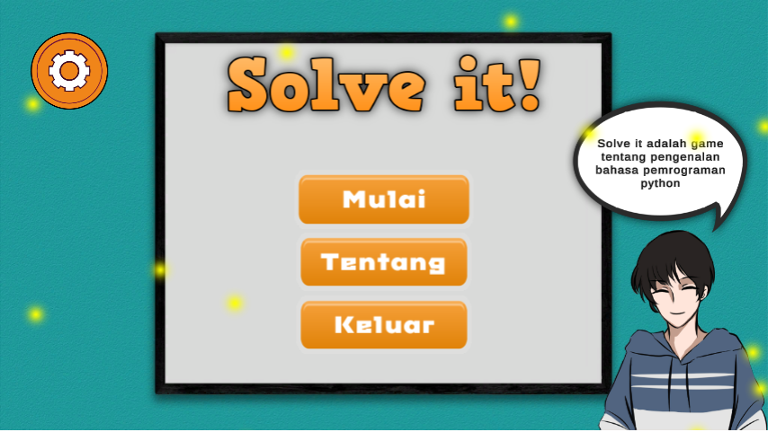
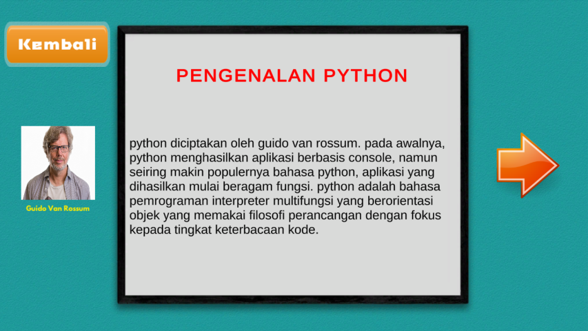
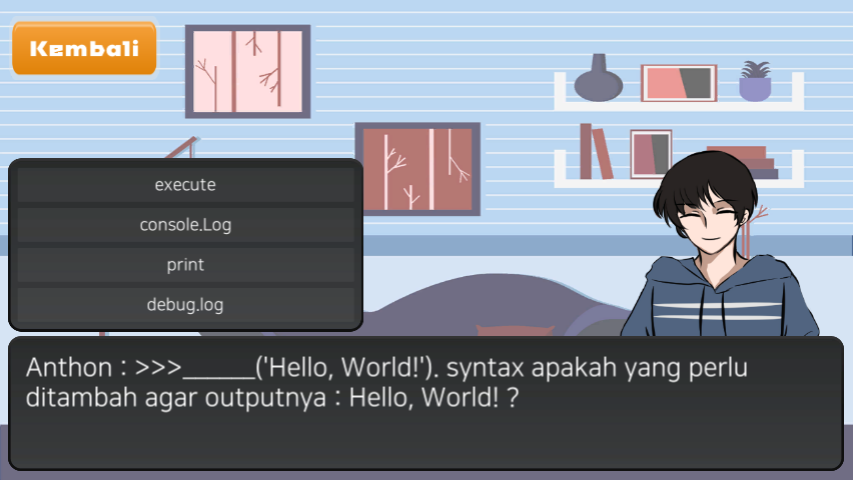

# Solve-it
Solve It adalah game edukasi yang ditujukan untuk siswa SMK ataupun semua orang yang ingin mempelajari bahasa pemrograman Pyhton dasar. Materi yang disampaikan yaitu tentang asal usul, Instalasi, contoh Syntax/kode, pengenalan operator, percabangan, dan lainnya. Dan juga setelah mempelajari materi-materinya siswa bisa mencoba kuis untuk menguji kompetensi diri. 

Project Matkul Pemrograman Game kelas IF 18 A 

kelompok wib00  
Design Grafis : Devka Savana 18312122  
Programmer    : Muhammad Yashlan Iskandar 18312170  
Composer      : Farhan Rosyid 18312108  

# ScreenShoot

